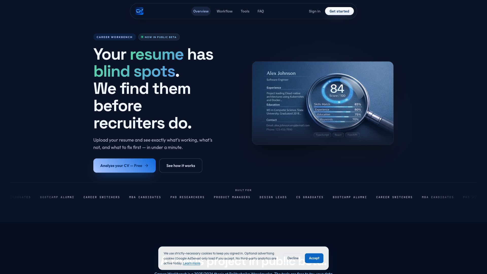
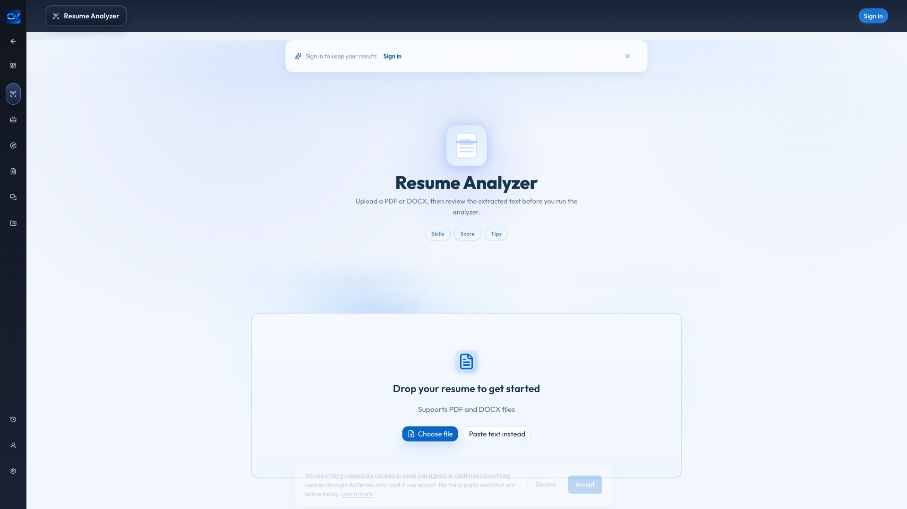
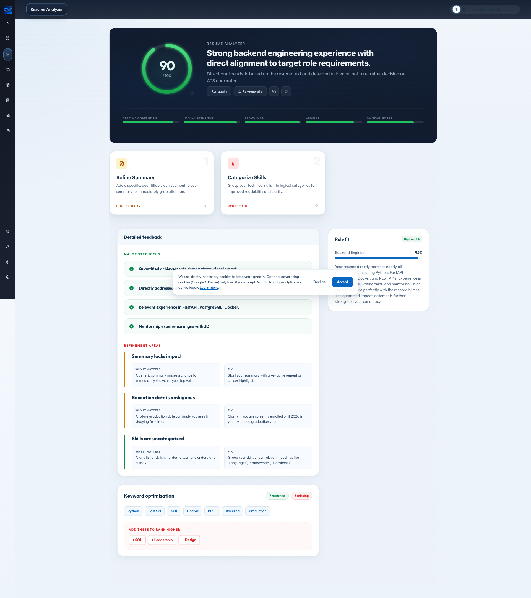
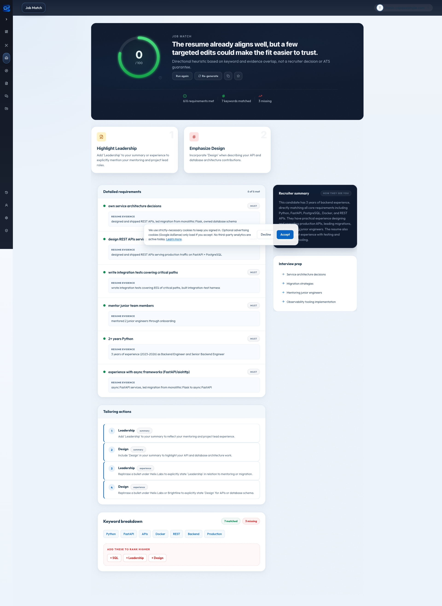

# Appendices

## Appendix A — Source listings

> Excerpted listings of the most thesis-relevant code. Each listing is a representative excerpt; full source files of the same name in the repository contain additional helpers, error handling, and inline documentation that are not reproduced here in the interest of length. Each listing is preceded by its file path so the reader can navigate to the corresponding location in the public repository at the moment of submission.

### A.1 Strong heuristic v2 — public entry point

`backend/app/services/quality_signals_v2.py`

```python
def build_resume_prepass_v2(
    resume_text: str,
    job_description: str | None = None,
    target_role_label: str | None = None,
) -> ResumePrepassV2:
    text = resume_text or ""
    sections = _detect_sections(text)
    bullets = [m.group(1) for m in _BULLET_RE.finditer(text)]
    tokens = _tokenize(text)

    resume_skills = _normalise_skills(text)
    matched: list[str] = []
    missing: list[str] = []
    matched_locations: list[tuple[str, str | None]] = []
    fuzzy_count = 0
    # ... (full body in the source file; see Section 4.2 of the thesis for the
    # accompanying methodological description)
```

### A.2 BM25 scoring

`backend/app/services/quality_signals_v2.py`

```python
def _bm25_score(
    resume_tf: dict[str, int],
    query_terms: list[str],
    idf: dict[str, float],
    avg_dl: float = 350.0,
    k1: float = 1.5,
    b: float = 0.75,
) -> float:
    """Standard BM25 score of a query against a single document's term-frequencies."""
    if not query_terms:
        return 0.0
    dl = sum(resume_tf.values()) or 1
    score = 0.0
    for term in query_terms:
        tf = resume_tf.get(term, 0)
        if tf == 0:
            continue
        term_idf = idf.get(term, math.log((1 + 0.5) / (0 + 0.5) + 1))
        norm = tf * (k1 + 1) / (tf + k1 * (1 - b + b * dl / avg_dl))
        score += term_idf * norm
    return score
```

### A.3 Runtime mode toggle

`backend/app/services/runtime_settings.py`

```python
ScoringMode = Literal["blended", "heuristic"]
_VALID_MODES: tuple[str, ...] = ("blended", "heuristic")

_initial_mode: ScoringMode = "blended"
configured = getattr(settings, "SCORING_MODE", "blended")
if configured in _VALID_MODES:
    _initial_mode = configured

_current_mode: ScoringMode = _initial_mode

def get_scoring_mode() -> ScoringMode:
    return _current_mode

def set_scoring_mode(mode: str) -> ScoringMode:
    global _current_mode
    if mode not in _VALID_MODES:
        raise ValueError(f"unknown scoring mode: {mode!r}")
    _current_mode = mode
    return _current_mode
```

### A.4 Shared tool pipeline

`backend/app/services/tool_pipeline.py`

```python
async def run_tool_pipeline(
    *,
    tool_name: str,
    service_fn: Callable[..., Awaitable[dict[str, Any]]],
    service_kwargs: dict[str, Any],
    label_fn: Callable[[dict[str, Any]], str],
    resume_text: str,
    job_description: str | None = None,
    feedback: str | None = None,
    parent_run_id: str | None = None,
    workspace_id: str | None = None,
    linked_context_ids: list[str] | None = None,
    current_user: User | None = None,
    db: Session,
    cache_extra_keys: dict[str, str] | None = None,
) -> dict[str, Any]:
    """Shared pipeline: sanitize -> cache -> service -> fallback -> persist -> respond."""
    # ... (sanitisation, cache lookup, service call, persistence, observability)
```

---

## Appendix B — Evaluation dataset description

The evaluation dataset used in Chapter 4.3 contains *N* = 30 resumes and *M* ≈ 20 job descriptions, organised into six role tracks: backend engineering, frontend engineering, full-stack engineering, data analytics, product design, and product management.

### B.1 Resume synthesis procedure

Each resume was synthesised from a templated structure that fills role-track-appropriate content into a fixed skeleton: a two-sentence summary, two or three employment entries with three responsibilities and one quantified achievement each, a skills list, a short Projects section with two open-source or side-project lines, and an education block. The synthesis script seeds the templated fields from a curated content library inside the script — role-track skill pools, action-verb-led outcome phrasings, fictional employer names, and a fixed candidate-name pool. Skill density and seniority increase monotonically across the five resumes per track so that the evaluation set spans junior, mid, and senior levels.

The synthesis script is `scripts/synthesise_eval_dataset.py`. It is fully deterministic: a fixed seed (`SEED = 42`) produces the same 30 resumes and 20 job descriptions on every run, which makes the evaluation manifest reproducible from the script alone.

### B.2 Job description synthesis procedure

Job descriptions were also synthesised from templates rather than scraped from public job boards. Each description draws responsibilities from the same role-track pool used for resumes, and the requirement list is composed from a track-specific must-have skill set sized by seniority (four to six core skills plus one to three secondary skills, with years-of-experience banding by junior, mid, and senior). Synthesising rather than scraping preserves a clean comparison surface (the same skill vocabulary in resume and JD), avoids any privacy or licence concern, and is a deliberate choice that limits external generalisability — see Section 4.4 of Chapter 4 for the limitation framing.

### B.3 Pair construction

The evaluation harness `scripts/eval_scoring.py` pairs each resume with every job description inside the same role track. The JD distribution is three JDs in four tracks and four JDs in two tracks, which produces an exact total of one hundred (resume, JD) pairs.

### B.4 Pair manifest

The manifest produced by the synthesis script at `thesis/eval-dataset.json` is a list of one hundred objects with the shape `{id, resume, jd, role_track}`. The `id` is composed as `r-<track>-<NN>__jd-<track>-<NN>` so that every row is traceable back to its constituent resume and job description, and every per-pair result in Section 4.3 can be re-queried by id.

---

## Appendix C — Screenshots of the running system

The screenshots in this appendix were captured at 1920 × 1080 viewport against the deployed system. The intent of the appendix is to demonstrate the engineering artefact — the running tools — rather than to document generic authentication UI; login forms, OAuth flows, and account-creation pages are therefore omitted in favour of screens that exhibit the analytical and generative tools described in Chapter 3 and the runtime scoring-mode switch documented in Section 4.2.9.

### C.1 Landing page



*Figure C.1: The public landing page at `https://thecareerworkbench.com`, presenting the six career-tooling pillars and the primary call-to-action to sign in or proceed as guest.*

### C.2 Resume Analyzer input page



*Figure C.2: The Resume Analyzer input page (`/resume`) as it renders for a guest visitor. The input surface accepts a free-text or uploaded resume, with an optional target job description, before invoking the analytical pipeline described in Chapter 3.2.*

### C.3 Resume Analyzer result page (blended mode)



*Figure C.3: The Resume Analyzer result page after a blended-mode (heuristic 40 % + LLM 60 %) run on the synthetic backend-engineer resume described in Chapter 4 paired with a representative backend-engineer job description. The page renders the overall score, the five-axis sub-score breakdown, the deterministic issues list, the prioritised top actions, and the role-fit narrative — the response shape documented in Chapter 3.2.3.*

### C.4 Job Match result page



*Figure C.4: The Job Match result page on the same input pair as Figure C.3. The view exposes the matched-keyword set, the missing-keyword set, the deterministic verdict, the recruiter-style summary, and the requirement-by-requirement breakdown produced by the prompt described in Chapter 3.3.3.*

---

## Appendix D — Configuration reference

### D.1 Backend environment variables

The following environment variables are read at process start and configure the deployed system. Defaults shown in parentheses; consult `backend/app/config.py` for the authoritative list.

| Variable | Purpose | Default |
|---|---|---|
| `DATABASE_URL` | PostgreSQL DSN | `sqlite:///./career_platform.db` |
| `SECRET_KEY` | JWT signing secret | (must override) |
| `ACCESS_TOKEN_EXPIRE_MINUTES` | Access-token lifetime | 30 |
| `REFRESH_TOKEN_EXPIRE_DAYS` | Refresh-token lifetime | 7 |
| `LLM_PROVIDER` | LLM dispatch backend | `vertex` |
| `LLM_MODEL` | Primary Gemini model | `gemini-2.5-flash` |
| `LLM_PRACTICE_MODEL` | Cheaper model used for interview practice feedback | (empty → falls back to `LLM_MODEL`) |
| `VERTEX_PROJECT_ID` | Google Cloud project | (must override) |
| `VERTEX_LOCATION` | Vertex region | `us-central1` |
| `BLENDED_SCORING_ENABLED` | Apply 60/40 LLM/heuristic blend | `true` |
| `SCORING_MODE` | Scoring core mode (`blended` or `heuristic`) — added with the comparative study | `blended` |
| `RESULT_CACHE_ENABLED` | In-memory cache | `true` |
| `RESULT_CACHE_TTL_SECONDS` | Cache TTL | 3600 |
| `CORS_ORIGINS` | Allowed CORS origins | `localhost` defaults |
| `FRONTEND_URL` | Canonical frontend URL | (set in production) |
| `GOOGLE_CLIENT_ID` / `GOOGLE_CLIENT_SECRET` / `GOOGLE_REDIRECT_URI` | Google OAuth | (must override) |
| `RESEND_API_KEY` | Transactional email | (must override) |
| `SENTRY_DSN` | Error tracking | (empty disables) |

### D.2 Administrative endpoints

The administrative HTTP API used for the comparative study is exposed under `/api/v1/admin/`:

- `GET /api/v1/admin/scoring-mode` → `AdminScoringModeResponse`
- `POST /api/v1/admin/scoring-mode` with body `{ "mode": "blended" | "heuristic" }` → returns the updated `AdminScoringModeResponse`

The response shape is:

```json
{
  "mode": "blended",
  "heuristic_version": "v1",
  "blended_weight_heuristic": 0.4,
  "blended_weight_llm": 0.6
}
```

Both endpoints require an authenticated administrator (the `users.is_admin` flag controls access) and are rate-limited at 60 requests per minute per administrator. The runtime mode change is held in process memory only; restarting the backend restores the configured default from the `SCORING_MODE` environment variable.

### D.3 Running the evaluation harness

```
$ cd backend
$ SCORING_MODE=blended RESULT_CACHE_ENABLED=false \
  python ../scripts/eval_scoring.py
$ python ../scripts/analyze_eval_results.py > ../thesis/chapter-04-results.md
```

The harness writes `thesis/eval-results.json`; the analyzer prints the Markdown tables ready to paste into Chapter 4.3.
