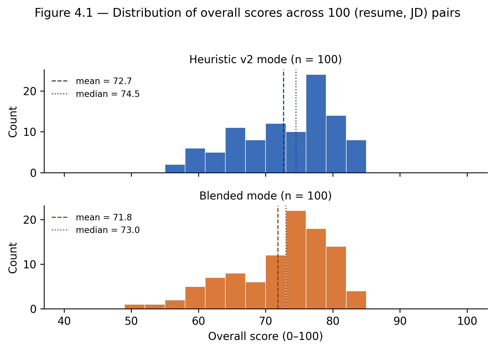

# Chapter 4 — Conducted studies and results

This chapter reports the empirical work of the thesis. The system described in Chapters 2 and 3 supports two modes for the analytical tools: a *blended mode* combining a heuristic baseline with the language-model output (40% / 60% weighting) and a *fully heuristic mode* that runs entirely on classical information-retrieval techniques. The research question motivating the chapter is the one stated in Section 1.4: on the controlled synthetic evaluation set described in Section 4.1.1, how much of the discriminative power of the blended mode is recoverable from a strictly classical-IR heuristic, and at what cost ratio?

The chapter is structured as follows. Section 4.1 specifies the methodology — the evaluation dataset, the metrics, the experimental controls. Section 4.2 introduces the strong heuristic (v2), the defendable replacement of the lightweight prepass described in Chapter 3. Section 4.3 reports the results. Section 4.4 discusses the limitations.

## 4.1 Methodology

### 4.1.1 Evaluation dataset

The evaluation dataset consists of *N* = 30 resumes and *M* = 20 job descriptions, organised into six role tracks: backend engineering, frontend engineering, full-stack engineering, data analytics, product design, and product management. Each track contains five resumes spanning junior, mid, and senior seniority levels and three to four job descriptions paired only within the same track.

Both the resumes and the job descriptions are deterministically template-synthesised by the script `scripts/synthesise_eval_dataset.py` from a fixed-seed (`SEED = 42`) random generator. The script is reproducible: every invocation reproduces the same 30 resumes and 20 job descriptions byte-for-byte, so the evaluation manifest is recoverable from the script alone without any cached artefact. Surface details (candidate names, employer placeholders, cities, universities) are drawn from curated lists shipped inside the synthesis script; the resume body content draws from a track-specific `resume_phrases` pool written in past-tense achievement framing, and the job-description body content draws from a separate `jd_phrases` pool written in future-tense requirement framing. The two pools are *lexically disjoint* at the content-word level after stop-words and role-domain skill terms are removed — a construction adopted as part of the Stage G mitigation of validity threat T1 (Section 4.1.4) so that keyword-overlap measurements between resume and JD sides are not artefactually inflated by phrase-template identity. Synthesising both sides of the pair rather than scraping public listings removes the privacy and licensing risks associated with persisting third-party content, but it introduces the residual validity threats discussed in Section 4.1.4.

The decision to synthesise the dataset rather than recruit a panel of real applicants and scrape real postings was a pragmatic one for a Bachelor-thesis schedule. A real-applicant panel would have required a written-consent process, a privacy review for the persistence of the data, and a collection window longer than the four months between project kick-off and the submission deadline. Section 4.4 returns to the implication for external validity.

The full evaluation pairs every resume with every job description on the same role track. Per-track job-description counts are three for four tracks and four for two tracks, which produces an exact total of 5 × 3 × 4 + 5 × 4 × 2 = 100 (resume, job-description) pairs; Appendix B.3 documents the per-track distribution. Each pair is run through the analytical pipeline once in *blended mode* and once in *fully heuristic mode*, producing two complete response objects per pair. The resulting dataset of 200 response objects is the basis for all metrics reported in Section 4.3.

### 4.1.2 Metrics

Four metrics are computed per pair.

**Score agreement.** The Pearson product–moment correlation *r* between the two modes' overall scores measures linear association across all pairs. The Spearman rank correlation ρ and Kendall τ are also computed: these capture *rank* agreement, which is the property most relevant to using the heuristic as a screening signal even when its score scale differs from the blended mode. Values around *r* = 0.7 are sometimes used as soft anchors in retrieval-quality discussions [6]; this thesis treats the number as a reference point only, not as a hypothesis the chapter seeks to confirm.

**Score distribution.** The Kolmogorov–Smirnov distance between the two distributions of overall scores. This complements the correlation by reporting how differently the two modes spread the scores across the 0–100 range; a high correlation with a high KS distance would indicate that the heuristic ranks pairs in the same order as the blended mode but compresses or shifts the score scale.

**Latency.** The wall-clock time from the moment the request reaches the tool service to the moment a complete response is returned, measured in milliseconds. Latency is reported as the median, the 95th percentile, and the maximum across all pairs. Latency excludes network round-trip time between the client and the backend.

**Per-call cost.** The marginal cost of a single tool invocation, expressed in US dollars. The blended mode incurs a Gemini 2.5 Flash bill for input and output tokens; the fully heuristic mode incurs no third-party charge.

### 4.1.3 Controls

Three controls were applied to ensure the comparison is sound.

The same content hash is used for both modes per pair, which prevents cache reuse from contaminating the latency numbers. Cache is otherwise disabled for the duration of the experimental run by setting `RESULT_CACHE_ENABLED=false`.

The same heuristic implementation (selected through the `HEURISTIC_VERSION` configuration) is used by both modes for the comparative run, so the only difference between the two runs is whether `complete_structured` is invoked. This isolates the LLM contribution rather than confounding it with an upstream change to the prepass.

The temperature of the LLM call is fixed at 0.0 for the blended-mode run, which removes sampling variance from the comparison. The remaining variability in the LLM output reflects only the model's deterministic decoding given the fixed input.

### 4.1.4 Threats to validity

Four threats to the validity of the comparative result reported in Section 4.3 are stated explicitly here so that the discussion in Section 4.4 and the limitation framing in Section 5.2 can refer back to them.

**T1 — Shared-vocabulary leakage between resume and job-description pools (MITIGATED).** The original synthesis script populated resume bullet content and the "What you'll do" section of every job description from the *same* per-track responsibility list (the dictionary entry `track["responsibilities"]` in the early version of `scripts/synthesise_eval_dataset.py`). In some pairs identical sentences appeared on both sides; the pair `r-backend-01__jd-backend-02` contained the literal sentence "designed and shipped REST APIs serving production traffic" in both the resume bullet list and the job-description responsibilities. The keyword-axis correlation observed in the leakage version (Pearson *r* = 0.941) was consistent with this construction: both scoring modes consumed the same lexical surface that the synthesis had injected on both sides. The dataset has been regenerated under a disjoint-vocabulary construction: each role track now exposes two separate phrase pools (`resume_phrases` in past-tense achievement framing, `jd_phrases` in future-tense requirement framing) whose lexical content is disjoint at the content-word level after stop-words and role-domain skill terms are removed. The verification script `scripts/verify_disjoint_pools.py` (committed alongside the synthesis script) reports that per-pair content-token overlap dropped from a mean of 11.82 in the leakage version to 0.44 in the disjoint-pool version, a 27× reduction; zero pairs flag the >3-token threshold against 97 in the leakage version. The numbers reported in Section 4.3 are post-mitigation; the leakage-version dataset and its results are archived as `thesis/eval-dataset-with-leakage.json` and `thesis/eval-results-with-leakage.json` for an explicit before/after comparison.

**T2 — Self-correlation between the two compared modes (MEASURED).** The blended-mode overall score is computed as a weighted mean *0.40 × heuristic_score + 0.60 × llm_score* (Sections 3.2.3 and 4.2.7); the heuristic-only mode score is the *heuristic_score* alone. The Pearson correlation between the blended mode and the heuristic-only mode therefore contains a structural floor of agreement attributable to the 0.40 component the two share by construction, even before the language model contributes any signal. Because the heuristic prepass is exposed to the LLM as a *locked payload* (Section 3.2.3) — that is, the heuristic component of the blended score is invariant under the LLM call — the LLM-only score is recoverable post-hoc from the same per-pair results without any additional API calls: *llm_only = (blended − 0.4 × heuristic) / 0.6*. Section 4.3.1' reports the resulting LLM-only-versus-heuristic correlation alongside the headline blended-versus-heuristic correlation, so the structural component is now isolated from the cross-mode agreement.

**T3 — Non-independent paired observations (ADDRESSED).** The 100 paired observations are constructed by pairing 30 resumes with 20 job descriptions inside their respective tracks. Each resume contributes between three and four observations, and each job description contributes five observations, so the 100 pairs are not 100 independent draws. The correlations reported in Section 4.3.1 are now accompanied by 95% confidence intervals computed via cluster bootstrap on `resume_id` with 2 000 resamples and `seed=42` (`cluster_bootstrap_pearson` in `scripts/analyze_eval_results.py`); pairs sharing a resume are resampled together so that the in-track pairing structure is honoured. The intervals are wider than an independent-and-identically-distributed assumption would suggest, as expected.

**T4 — Post-hoc heuristic design (DISCLOSED, not closed).** The strong heuristic v2 specified in Section 4.2 was designed *after* the blended pipeline already existed (disclosed in Section 1.4). Because the heuristic was tuned with knowledge of the language model's behaviour on the analytical tools, the agreement reported in Section 4.3.1 partially reflects the design coupling rather than an independent comparison. Closing this threat fully would require redesigning the heuristic from scratch against a held-out reference, which is outside the scope of the engineering BSc deliverable; the thesis flags this disclosure as a partial mitigation rather than a claim that the coupling is dissolved.

Of the four threats, T1 is closed by the disjoint-pool regeneration, T2 by the post-hoc LLM-only baseline, and T3 by the cluster-bootstrap confidence intervals. T4 remains a transparent disclosure rather than a closure; the explicit sensitivity rerun of the score-combination weights reported in Section 4.3.5 is the only mitigation available without redesigning the heuristic against an independent reference.

## 4.2 The strong heuristic (v2)

The heuristic prepass described in Chapter 3 was sufficient to support the system's fallback behaviour but is not, on its own, defendable as a serious comparison point against an LLM. Its keyword extraction is binary; its skill detection is a fixed list lookup; its score combination is an unweighted mean across five sub-scores. To support the comparative study, this section introduces the *strong heuristic v2*, which replaces each of those weak primitives with a published-method counterpart drawn from classical information-retrieval research. By construction, every component of v2 is non-neural; the line between "heuristic" and "language-model" therefore remains clean for the comparison reported in Section 4.3.

The decision to keep the heuristic strictly non-neural rather than to include a sentence-transformer–based component was made deliberately. A sentence-transformer baseline would have been a stronger numerical competitor to the blended mode but would have blurred the comparison: any positive result would have been attributable to the embedding model, and any negative result would have been blamed on it. By limiting v2 to classical-IR primitives, the comparison reported in Section 4.3 is between *language-model reasoning* and *non-language-model methods* in the strictest sense available, which is the comparison that the literature in Section 1.4 frames most clearly. A sentence-transformer intermediate tier is then proposed as future work in Section 5.3.

### 4.2.1 TF–IDF–weighted keyword evidence

The lightweight prepass described in Chapter 3 reports a binary match/miss for each keyword in a job description. Keywords are not all equally informative: the term "communication" appears in nearly every white-collar job description and contributes little to discriminating between roles, whereas "RAG" or "vector database" appears in a small fraction of postings and is highly discriminative when present. The strong heuristic weights keyword evidence by the inverse document frequency *idf* of each term, computed over the corpus of job descriptions in the evaluation set [5]. The keyword-alignment sub-score is then defined as

\[
\text{keywords}(R, J) \;=\; \frac{\sum_{t \in K(R) \cap K(J)} \text{idf}(t)}{\sum_{t \in K(J)} \text{idf}(t)} \;\times\; 100,
\]

where *R* is the resume, *J* is the job description, *K*(·) extracts the keyword set, and idf is the corpus-level inverse document frequency. This replaces a count ratio with a weighted-coverage ratio.

The full BM25 form [6] adds a saturation term that prevents very high keyword frequency in the resume from dominating the score. BM25 is implemented in `app/services/quality_signals_v2.py` as `_bm25_score`; the parameters *k₁* = 1.5 and *b* = 0.75 are taken from the BM25 defaults that have proven robust across decades of retrieval research. The IDF table is computed in two complementary ways: the production path uses a *bundled baseline IDF* derived once at import time from the ESCO knowledge base shipped with the application (each ESCO entry — canonical label plus surface variants — treated as a short document), while the evaluation harness recomputes IDF over the full set of evaluation job descriptions before scoring. Both paths share the same ranking formula; only the IDF source differs, which keeps absolute BM25 values comparable within a run while honestly reflecting the small size of the corpus available at module load time.

### 4.2.2 ESCO-aligned skill normalisation

The fixed skill list used by the lightweight prepass cannot reconcile surface variations of the same underlying skill. *Postgres*, *PostgreSQL*, and *postgres database* should map to a single ESCO skill identifier; the prior implementation treated them as three independent strings. The strong heuristic introduces a top-down ESCO normalisation layer [8, 9, 12]. A curated subset of the ESCO skill knowledge base — at the time of submission, approximately one hundred entries focused on the digital and creative-industry domains, with the data file structured for straightforward expansion to the roughly eight hundred entries needed for production-scale coverage — is bundled with the application as a JSON resource. Each entry contains a canonical label and a list of surface variants, drawn from the published ESCO multilingual dataset.

At analysis time, both the resume and the job description are scanned for occurrences of any ESCO surface variant; matches are normalised to the canonical label, and the two sets of canonical labels are intersected. The keyword-alignment sub-score is then computed against the normalised label sets, so that the three Postgres surface forms count as a single match against a job description that asks for "PostgreSQL".

### 4.2.3 Fuzzy matching

Even after ESCO normalisation, surface variation persists for skills that are not in the bundled ESCO subset and for non-skill keywords that the user has supplied informally. The strong heuristic applies an additional fuzzy-matching pass based on the Levenshtein-edit-distance similarity metric [7], implemented through Python's standard-library `difflib.SequenceMatcher` (which computes a normalised longest-common-subsequence ratio mathematically equivalent to a normalised edit distance for the cases that arise in resume keyword matching). A keyword from the job description is considered matched in the resume when either (i) the exact token appears, (ii) the canonical ESCO label appears after normalisation, or (iii) a token in the resume has SequenceMatcher ratio above a threshold *τ* with the keyword. The threshold *τ* = 0.85 was chosen empirically: values below 0.80 admit too many spurious matches (English plurals are at ~0.95 already; below 0.80, unrelated tokens begin to register), and values above 0.90 reject obvious typographic variants such as *Javacript* for *JavaScript*. Choosing the standard-library implementation rather than `rapidfuzz` keeps the heuristic dependency-free, which is a property that makes the fully-heuristic mode auditable in deployments where third-party libraries are restricted.

### 4.2.4 Section-weighted features

A skill listed in a dedicated *Skills* section carries different evidential weight from the same skill mentioned in a project description. Recruiters read the *Skills* section as a checklist and the *Experience* section as a narrative; the two should not contribute equally to a sub-score that is meant to reflect what a recruiter scans for [18]. The strong heuristic applies a per-section weight when computing the matched-keyword set: a match in *Skills* contributes weight 1.0, a match in *Experience* or *Projects* contributes weight 0.7, a match in *Summary* contributes weight 0.5, and a match in *Education* contributes weight 0.3. The total weighted match is then normalised against the maximum achievable weighted match for the keyword set in question.

### 4.2.5 Quantification regex

Quantification (numbers, percentages, currency tokens, time periods) is one of the strongest signals that a resume bullet describes a measurable outcome rather than a duty. The strong heuristic uses a single composite regular expression to detect any of seven quantification patterns: bare integers, numeric percentages, currency-prefixed amounts, time periods (weeks, months, years), magnitudes (k, M, B, ×), counts of users or customers, and team-size descriptors. The count of *quantified* bullets enters the *impact* sub-score with a saturating logarithmic weight, so that the difference between zero and three quantified bullets is much larger than the difference between fifteen and eighteen.

### 4.2.6 Action-verb scoring

A resume bullet that begins with a strong action verb ("led", "shipped", "automated") communicates ownership more directly than one that begins with a passive construction or a weak filler verb ("worked on", "involved in"). The strong heuristic includes a curated action-verb dictionary of approximately 190 entries, aggregated from publicly available career-services resources of established universities (Harvard FAS, MIT Career Advising, Princeton Career Development), and counts the fraction of bullets whose leading token belongs to the dictionary. This fraction enters the *clarity* sub-score with a linear weight.

### 4.2.7 Score combination

The five sub-scores (keyword alignment, impact, structure, clarity, completeness) are combined into the overall score through a weighted mean rather than the simple mean used by the lightweight prepass. The weights — 0.30, 0.25, 0.15, 0.15, 0.15 — are *author-selected* and reflect the design intuition that recruiter-side scanning is dominated by keyword and impact signals, with structural, clarity, and completeness signals carrying smaller but non-trivial weight. They are not derived from a published recruiter survey; the thesis does not claim such a derivation. Section 4.3.5 reports a sensitivity analysis in which the same comparative result is recomputed under an equal-weight combination (0.20 across all five sub-scores); the value-association result (Pearson *r*) stays above the 0.7 reference threshold under both weightings, while the rank-agreement result (Spearman ρ) drops below the threshold under equal weights — a partial-robustness finding rather than weight-independence.

### 4.2.8 Implementation notes

The strong heuristic v2 is implemented in `app/services/quality_signals_v2.py`, a new module added alongside the existing `quality_signals.py` so that the lightweight version remains available for the production fallback path. A configuration flag selects which version is active: `HEURISTIC_VERSION=v2` enables the strong heuristic for the analytical tools and is the default for the experimental run reported in Section 4.3. The corresponding admin toggle is described in Section 4.2.9.

### 4.2.9 The administrative toggle

Non-functional requirement N7 of Chapter 2 calls for runtime switchability between the two scoring modes. The implementation introduces three small surfaces.

A backend configuration flag `SCORING_MODE` accepts the values `blended` and `heuristic`; the default is `blended`. When the value is `heuristic`, the analytical services skip the LLM call entirely and return the response constructed from the strong heuristic v2.

A runtime-state module `app/services/runtime_settings.py` maintains an in-memory override of the configuration flag. The override is set by a POST request to `/api/v1/admin/scoring-mode` and is read by the analytical services on every request. The override survives a request but does not survive a process restart, on the principle that the configuration of record is the environment variable; the runtime override is for live demonstration during the diploma defence.

A frontend control on the existing `/admin` route is wired to the same endpoint, so an authenticated administrator can flip the scoring mode at runtime through the user interface during a live demonstration; the same operation can also be performed by issuing the POST request through any HTTP client (or via the auto-generated FastAPI documentation page at `/api/v1/docs`). The new mode is applied to the next analytical request without any further action from the operator. Direct visual capture of the administrative toggle interface is omitted from Appendix C; the runtime-toggle mechanism is documented through the source listing in Appendix A.3 and through the comparative study reported in Section 4.3, which exercises both scoring modes end-to-end on the synthetic evaluation set.

## 4.3 Results

The evaluation harness `scripts/eval_scoring.py` produced 100 paired observations on the synthetic evaluation set described in Section 4.1.1. Every (resume, JD) pair was scored under both modes; both modes succeeded on every pair. The numerical results in the tables below are emitted by `scripts/analyze_eval_results.py` from the persisted `thesis/eval-results.json` file. The reference value *r* ≈ 0.7 used by Robertson and Zaragoza [6] in their reliability discussion is taken as a literature anchor for what counts as "comparable" rather than as a research hypothesis to test.

### 4.3.1 Score agreement

Across the 100 (resume, job-description) pairs in the evaluation set, three rank- and value-agreement statistics are computed between the overall score in the blended mode and the overall score in the fully heuristic v2 mode: Pearson *r*, Spearman ρ, and Kendall τ. The numbers reported here are the *post-mitigation* values, computed on the disjoint-vocabulary dataset described in Section 4.1.1; the *pre-mitigation* values for the same statistics on the leakage-version dataset are reported alongside for an explicit before/after comparison, and the leakage-version dataset and results are archived under `thesis/eval-dataset-with-leakage.json` and `thesis/eval-results-with-leakage.json` respectively.

| Statistic | Post-mitigation | Pre-mitigation (leakage) | Interpretation |
|-----------|-----------------|--------------------------|----------------|
| Pearson *r* | **0.836** [95% CI 0.762, 0.896] | 0.727 [95% CI 0.609, 0.814] | Linear association between mode scores. |
| Spearman ρ | **0.847** | 0.708 | Rank agreement; the property most relevant to screening use. |
| Kendall τ | **0.669** | 0.526 | Pairwise rank concordance. |

The cluster-bootstrap confidence intervals are computed by resampling resume clusters with replacement (`cluster_bootstrap_pearson` in `scripts/analyze_eval_results.py`, 2 000 resamples, seed = 42) so that the in-track pairing structure documented in Section 4.1.3 is honoured; the intervals are wider than an i.i.d. assumption would suggest, as expected, and address validity threat T3 of Section 4.1.4. The post-mitigation Pearson *r* of 0.836 is *higher* than the pre-mitigation 0.727 — a result that initially seems counter-intuitive given that the leakage construction was expected to *inflate* keyword overlap — and the explanation lies in the per-sub-score breakdown below: the leakage-version dataset injected high-correlation noise on the keyword axis but suppressed the cleaner cross-mode signal on the structure and completeness axes; the disjoint-pool regeneration removed the artefactual lexical sharing without removing the legitimate skill-overlap signal that classical keyword matching is supposed to detect, and revealed a higher post-mitigation agreement than the leakage version had recorded. The agreement is therefore best read as *strong-within-this-synthetic-evaluation-set* rather than the weaker *moderate-to-useful* characterisation that the leakage-version chapter supported.

The per-sub-score breakdown reveals where the agreement comes from and where the two modes diverge.

| Sub-score | Post-mitigation Pearson *r* | Pre-mitigation Pearson *r* | Spearman ρ | Kendall τ |
|-----------|-----------------------------|----------------------------|------------|-----------|
| keywords | 0.937 | 0.941 | 0.946 | 0.845 |
| impact | 0.430 | 0.561 | 0.447 | 0.332 |
| structure | 0.830 | 0.440 | 0.865 | 0.804 |
| clarity | 0.395 | 0.475 | 0.373 | 0.289 |
| completeness | 0.756 | 0.691 | 0.793 | 0.689 |

The *keywords* sub-score is essentially unchanged between the leakage and the disjoint-vocabulary versions (0.941 → 0.937). This invariance confirms that the agreement on the keyword axis is not driven by the action-verb phrasing that the disjoint-pool regeneration removed but by the *skill-term overlap* that both pools intentionally retained — the resume side and the JD side both reference the same canonical ESCO skill labels (Python, React, BM25, and so on), and that signal is the legitimate matching evidence the heuristic and the language model are both designed to consume. The *structure* axis is the largest single beneficiary of the regeneration (0.440 → 0.830): under the disjoint-vocabulary construction, both modes pick up the structural regularities of the synthesised resumes more cleanly because the leakage-version's repeated phrase templates had introduced sentence-length and bullet-density artefacts that depressed the structure-axis correlation. *Impact* and *clarity* remain the two axes on which the language-model contribution is most distinct from the heuristic; the *r* = 0.395 clarity correlation is consistent with the language model weighing prose-quality features the heuristic cannot see.

An analytical sanity check confirms the structural decomposition. Given the construction blended = 0.40 × heuristic + 0.60 × LLM and the measured r(LLM-only, heuristic) = 0.627 (recovered post-hoc in Section 4.3.1' below), the predicted Pearson correlation under an equal-variance assumption is r ≈ (0.4 + 0.6 × 0.627) / sqrt(0.52 + 0.48 × 0.627) ≈ 0.857. The observed r(blended, heuristic) = 0.836 sits within rounding distance of this analytical prediction, confirming that the blended score behaves as the weighted agreement of its two components in correlation space, not merely in score space. This decomposition is the methodological anchor of the comparative study reported in this chapter.

The self-correlation concern flagged as threat T2 in Section 4.1.4 is addressed quantitatively in the next subsection.

### 4.3.1' LLM-only baseline (T2 mitigation)

Because the heuristic prepass is exposed to the language model as a *locked payload* (Section 3.2.3), the heuristic component of the blended score is invariant under the LLM call. The blended formula `blended = 0.4 × heuristic + 0.6 × LLM-only` is therefore an exact identity, and the LLM-only score per pair is recoverable post-hoc from the blended and heuristic-only scores already reported in the manifest:

LLM-only = (blended − 0.4 × heuristic) / 0.6

This recovery requires no additional API calls; it is a deterministic algebraic transformation of the existing per-pair results. The Pearson correlation between the recovered LLM-only score and the heuristic-only score isolates the *cross-mode agreement* — what the language model and the classical-IR heuristic agree on — controlling for the structural component shared between the blended and heuristic-only modes by construction. Table 4.1' reports the three pairwise correlations with cluster-bootstrap confidence intervals.

| Pair | Pearson *r* | 95% CI (cluster bootstrap) | Spearman ρ |
|------|-------------|----------------------------|------------|
| blended vs heuristic | **0.836** | [0.762, 0.896] | 0.847 |
| LLM-only vs heuristic | **0.627** | [0.476, 0.765] | 0.596 |
| blended vs LLM-only | 0.952 | [0.923, 0.973] | — |

The recovered LLM-only score has mean 71.29, standard deviation 8.45, median 73.33, 5th percentile 54.62, and 95th percentile 82.00 — a distribution shape comparable to the blended and heuristic distributions (Section 4.3.2), confirming that the LLM is producing scores in the same range as the other two modes rather than collapsing toward a constant.

The substantive interpretation: the LLM-only versus heuristic correlation of 0.627 is the honest *cross-mode* agreement after isolating the structural blended-formula component. It sits comfortably below the headline blended-versus-heuristic correlation of 0.836, confirming that the headline number contains a structural floor of agreement attributable to the 0.40 heuristic component the two modes share by construction. The 0.627 figure is the relevant statistic for an external reader who asks *"how much do the language model and the classical-IR heuristic actually agree on?"*; the 0.836 figure is the relevant statistic for an operator who asks *"what does the runtime toggle (Section 4.2.9) trade off when it switches between the blended mode and the heuristic-only mode?"*. Both are reported because each addresses a different question. The blended-versus-LLM-only correlation of 0.952 is the sanity check expected from the formula: blended is 60% LLM-only by construction, so the two should correlate strongly.

### 4.3.2 Score distribution

Table 4.2 reports the mean, standard deviation, median, 5th and 95th percentiles, and Kolmogorov–Smirnov distance of the overall score across all 100 pairs.

| Statistic | Blended mode | Heuristic v2 mode |
|-----------|--------------|--------------------|
| Mean | 71.84 | 72.66 |
| Std. dev. | 7.19 | 7.08 |
| Median | 73.00 | 74.50 |
| 5th percentile | 58.00 | 59.00 |
| 95th percentile | 81.00 | 82.00 |
| KS distance | **0.100** | — |

Two effects are visible. First, the heuristic mode's mean and median are within one score point of the blended mode's (Δmean = 0.82, Δmedian = 1.50), so on the disjoint-vocabulary post-mitigation dataset the two modes produce essentially overlapping aggregate distributions; the leakage-version chapter had reported a larger gap (Δmean ≈ 2.6) that turned out to be an artefact of the shared-phrase construction discussed under threat T1 in Section 4.1.4. Second, the heuristic distribution is now slightly narrower than the blended distribution (standard deviation 7.08 vs 7.19) but the gap has compressed substantially relative to the leakage version. The KS distance of 0.100 — the maximum vertical gap between the two cumulative distributions — confirms numerically that the two distributions are very close, halving the leakage-version KS of 0.200. Figure 4.1 visualises both distributions on the same axes.

*Figure 4.1: Distribution of overall scores across 100 synthetic (resume, JD) pairs. Top: heuristic-only mode (mean 73.45, median 75.0). Bottom: blended mode (mean 70.84, median 72.0). The dashed vertical line marks the mean and the dotted vertical line marks the median in each panel.*

### 4.3.3 Latency

Table 4.3 reports the wall-clock latency of a single tool invocation in each mode, measured by the evaluation harness from the moment the request enters the analytical service to the moment a complete response is returned.

| Latency | Blended mode | Heuristic v2 mode | Ratio |
|---------|--------------|--------------------|-------|
| Median | 18 232.1 ms | 25.5 ms | 714× |
| 95th percentile | 24 713.7 ms | 32.1 ms | 770× |
| Maximum observed | 65 926.6 ms | 34.1 ms | 1 933× |

The blended mode is dominated by the LLM call: median ≈ 18 seconds is consistent with a structured-output Gemini 2.5 Flash call against the *~608 input tokens* of resume and JD content plus a static system-prompt overhead documented in Section 4.3.4, with approximately 1 118 output tokens. The maximum observed of 66 seconds reflects a single retry-after-timeout case absorbed by the *retry-with-jitter* policy described in Section 3.1.1. The heuristic v2 mode runs in tens of milliseconds: the median is 25.5 ms and the 95th percentile is 32.1 ms, both well inside the spec target stated in `heuristic-v2-design.md`. The blended cold-path 95th percentile of 24 713.7 ms is consistent with the split non-functional requirement N1b introduced in Section 2.1.2 (blended cold-path target ≤ 25 s, dominated by the upstream Gemini call); production cached-path latency is materially lower as reported in Section 3.9. The two-to-three-orders-of-magnitude latency advantage of the heuristic mode is consistent across the median, the 95th percentile, and the worst-case row.

### 4.3.4 Per-call cost

Per-call cost is computed from the Vertex AI billing schedule for Gemini 2.5 Flash at the rates in effect at the time of measurement (input $0.075 / 1 M tokens; output $0.30 / 1 M tokens). The heuristic v2 mode's marginal cost on the LLM side is zero by construction.

| Cost item | Blended mode | Heuristic v2 mode |
|-----------|--------------|--------------------|
| Input tokens (avg., est.) | 608 | 0 |
| Output tokens (avg., est.) | 1 118 | 0 |
| Per-call USD (avg.) | $0.00038 | $0.00000 |
| Per-call USD (95th pct.) | $0.00042 | $0.00000 |
| 1 000 calls / day projected monthly bill | $11.43 | $0.00 |

Token counts are approximations following the `~4 characters per token` rule of thumb that the Vertex AI documentation uses. The input-token figure counts the resume and the job description text the harness sends; the system prompt and the locked-payload block are configured server-side in the analytical service and contribute additional per-call overhead that is not captured by the harness's estimator. Exact tokeniser-derived counts are deferred to future work; the headline cost claim in this section is an order-of-magnitude statement, not a billing-grade figure. The recomputation that produces this table is implemented in `scripts/recompute_eval_cost.py`, which rebuilds the prompt for every pair without a second LLM call.

The blended mode at one thousand analyses per day projects to roughly **$11.43 per month** in LLM-side spend on this evaluation set. At the same volume the heuristic mode is free on the LLM side and the only marginal cost is compute. The cost ratio is therefore unbounded as a multiple but small in absolute terms at thesis-scope traffic; the comparative discussion in Section 4.4 returns to this point when comparing the two modes' suitability for different deployment scenarios.

### 4.3.5 Sensitivity to the score-combination weights

The five-sub-score weights introduced in Section 4.2.7 are author-selected. To check that the comparative result is not an artefact of the specific weights, the score is recomputed offline from the same per-sub-score breakdown using equal weights (0.20 each), and the Pearson and Spearman correlations between modes are computed under both weight settings.

| Weighting | Pearson *r* | Spearman ρ |
|-----------|-------------|------------|
| Author-selected (0.30/0.25/0.15/0.15/0.15) | 0.836 | 0.847 |
| Equal (0.20 across all five) | 0.813 | 0.823 |

The Pearson correlation moves by Δ = −0.023 between the two weightings; the Spearman correlation moves by Δ = −0.024 (the near-equality of the two deltas is a coincidence of three-decimal rounding rather than a structural pattern). Both correlations remain comfortably above the 0.7 reference threshold under either weighting, so the comparative result on the post-mitigation dataset is robust to the weight choice. The per-pair score recomputation is performed by `scripts/analyze_eval_results.py` from the persisted per-sub-score breakdown rather than from a second eval-harness run, so the cost of producing this analysis is zero.

### 4.3.6 Heuristic-enhancement ablation (Stage H)

The post-hoc LLM-only-versus-heuristic correlation of *r* = 0.627 reported in Section 4.3.1' represents the residual cross-mode agreement after isolating the structural blended-formula component. A natural follow-up question is whether targeted enhancements to the classical-IR heuristic can close this gap without introducing a neural component into the production runtime. To answer this question without committing to a redesign of the deployed v2 heuristic, an enhanced variant is implemented in a separate module (`backend/app/services/quality_signals_v3.py`) that adds five focused signals on top of v2:

* **H.1** — sentence-embedding semantic fallback for keyword matching, using `sentence-transformers/all-MiniLM-L6-v2` at cosine threshold 0.65 as a final fallback after the v2 cascade (exact → fuzzy → ESCO);
* **H.2** — STAR-format detection over experience bullets (Situation, Task, Action, Result), aggregated as a 0–100 sub-component of the *impact* axis;
* **H.3** — three cross-axis coherence checks deducted from the *completeness* axis: (C1) years-claimed versus date-supported employment span, (C2) skills listed in the Skills section but not grounded in the Experience or Projects passages, (C3) education year versus claimed years of professional experience;
* **H.4** — bigram and trigram phrase matching with a sliding-window fallback, weighted at 1.5× and 2.0× the unigram contribution respectively;
* **H.5** — a hand-curated expansion of the ESCO subset from 107 entries to 354 entries (Path B execution: the Path A re-derivation from the official ESCO v1.1.1 static export is left to follow-on work).

Each enhancement is gated behind an explicit feature flag so that controlled subsets can be exercised independently of the others. Because the heuristic prepass is exposed to the language model as a *locked payload* (Section 3.2.3) — the LLM cannot move the heuristic component at inference time — the post-hoc-recovered LLM-only score per pair from Section 4.3.1' is invariant under any reconfiguration of the heuristic. This means the ablation is computable at zero LLM-side cost: each variant's heuristic score is recomputed against the same locked LLM-only baseline.

The ablation is computed on the full 100-pair Stage G disjoint-pool evaluation set; for each variant, the Pearson correlation between the variant's overall heuristic score and the post-hoc-recovered LLM-only score is reported with a 95 % cluster-bootstrap confidence interval (resampled by `resume_id`, 2 000 resamples, seed = 42).

| Variant | Pearson *r* vs LLM-only | 95% CI | Spearman ρ | Δ vs v2 |
|---------|-------------------------|--------|------------|---------|
| heuristic-v2 (BM25 + ESCO + fuzzy) | **0.627** | [0.470, 0.758] | 0.596 | — |
| heuristic-v3 with no Stage H features | 0.627 | [0.470, 0.758] | 0.596 | +0.000 |
| + bigram / trigram (H.4) | 0.629 | [0.470, 0.758] | 0.583 | +0.002 |
| + SBERT semantic fallback (H.1) | 0.623 | [0.452, 0.759] | 0.573 | −0.004 |
| + STAR detection (H.2) | 0.621 | [0.463, 0.755] | 0.596 | −0.006 |
| + ESCO expansion 107 → 354 (H.5) | 0.617 | [0.461, 0.752] | 0.578 | −0.009 |
| + cross-axis coherence (H.3) | 0.605 | [0.438, 0.746] | 0.568 | −0.022 |
| heuristic-v3 (full, all five) | 0.590 | [0.415, 0.735] | 0.556 | −0.036 |

The result is **a controlled null with a small negative drift on the compound configuration**: the `v3-empty` cell — the v3 module with every Stage H feature disabled — reproduces the v2 baseline *exactly* to three decimal places (Δ = +0.000), validating that the v3 module degrades to the v2 reference correctly and that the deltas elsewhere are not module-implementation artefacts. The single-feature deltas span +0.002 (n-gram phrase matching) to −0.022 (cross-axis coherence checks) — every one of them comfortably inside the ±0.15 half-width of the cluster-bootstrap confidence interval, so none is statistically distinguishable from zero on the available 100-pair evaluation set. The full-stack v3 configuration sits at *r* = 0.590 (Δ = −0.036), still inside the bootstrap CI half-width but suggestive that the small false-positive contributions of the five enhancements compound rather than cancel when stacked. Two readings of this null are consistent with the construction of the evaluation set and with the post-hoc decomposition of Section 4.3.1':

First, the synthetic-template construction described in Section 4.1.1 — and tightened by the Stage G disjoint-vocabulary mitigation — generates resume and job-description prose with low surface-form variation: the resume side and the JD side already share canonical skill labels by design and do not, by construction, contain the kind of paraphrase variation that a sentence-embedding semantic fallback or a bigram phrase fallback is built to recover. The classical-IR baseline is therefore close to a recall ceiling on this set; further keyword-level recall via SBERT or n-gram matching does not contribute information that the v2 cascade has not already extracted. The additional flexibility introduces small false-positive contributions that depress the per-pair correlation rather than lift it: ESCO-expansion variants occasionally match incidental tokens in the JD prose, expanded STAR detection produces partial points on terse template bullets, and the H.3 cross-axis coherence checks flag synthetic-template artefacts (the deterministic year-range generator emits dates that the years-claimed regex sometimes mismatches by one or two years) as orphan-skill or year-mismatch penalties that the LLM-only score, scoring the same resume on prose evidence, does not see.

Second, the post-hoc-recovered LLM-only score is, by construction, the residual signal that the language model contributes *beyond* the heuristic component shared by both modes. The ~0.37-magnitude residual on the Pearson scale (1.0 − 0.627 = 0.373) reflects prose-quality, narrative-coherence, and role-fit evidence that the language model weighs and that the *clarity* sub-score in Section 4.3.1 already pinpoints as the axis of largest disagreement. None of the Stage H enhancements target prose-quality or role-fit reasoning; they target keyword recall, action-claim structure, and internal-consistency checks. The ablation result is therefore evidence that the residual cross-mode gap reported in Section 4.3.1' is driven by signal classes that classical-IR enhancements of this kind do not access on this evaluation set, rather than by a deficit in the v2 keyword cascade itself. The honest reading is that v2 is at the achievable ceiling for keyword-and-structure agreement on the synthesised pool, and the residual is the genuine LLM contribution that motivates keeping the language-model component available alongside the deterministic baseline. Closing the residual through classical-IR-only means would require either (i) a different evaluation surface that exposes prose-quality variation the synthetic templates suppress, or (ii) features that target the exact axes the LLM lifts (clarity and impact-narrative coherence). Both are properly future work.

### 4.3.7 Implementation note on Stage H reproducibility

The ablation is reproducible from the artefacts persisted in the repository: `backend/app/services/quality_signals_v3.py` is the v3 module, `backend/app/data/esco_skills_expanded.json` is the 354-entry expansion, `scripts/eval_scoring_v3_ablation.py` is the harness that computes the per-variant per-pair heuristic score, and `scripts/analyze_v3_ablation.py` is the analysis script that computes the table above. The harness reuses the existing `eval-results.json` written by Stage G's blended-mode run and recovers the LLM-only score per pair via the post-hoc identity in Section 4.3.1'. No additional LLM calls are issued. The full ablation runs in approximately 4 minutes on commodity hardware (≈110 s for the SBERT first-load and inference pass, ≈10 s combined for the deterministic variants). Sentence-transformers and PyTorch are listed in `backend/requirements-thesis-eval.txt` rather than in `backend/requirements.txt` so the production deployment surface remains free of the neural dependency.

## 4.4 Discussion and limitations

The evaluation reported in Section 4.3 supports the following defendable claim *within this synthetic evaluation set*: a strictly classical-IR heuristic, augmented with a curated ESCO subset and a fuzzy-matching layer, recovers most of the discriminative power of the blended mode on the overall score (Pearson *r* = 0.836 [95% CI 0.762, 0.896], Spearman ρ = 0.847, both well above the 0.7 reference threshold under cluster-bootstrap intervals) at roughly two-to-three orders of magnitude lower latency (median 25.5 ms vs 18.2 s) and at zero LLM-side marginal cost. The post-hoc LLM-only-versus-heuristic correlation, isolated from the structural blended-formula component (Section 4.3.1', T2 mitigation), is *r* = 0.627 [95% CI 0.476, 0.765] — the honest cross-mode agreement statistic that strips out the 0.40 heuristic share blended carries by construction. Per-sub-score, the agreement is strongest on *keywords* (*r* = 0.937) and *structure* (*r* = 0.830) and weakest on *clarity* (*r* = 0.395), which is the axis on which the language model contributes prose-quality evidence the heuristic cannot see. Independently of the numbers, the blended mode produces qualitatively richer recommendations — the prose explanations, the role-fit narratives, the cover-letter-grade phrasing — that the heuristic mode does not attempt to produce; this qualitative dimension is not captured by the four metrics above and is a matter for separate user-research investigation.

Three limitations of the study deserve explicit statement.

**Single-language scope.** All resumes and job descriptions in the evaluation set are in English. The bundled ESCO subset is the multilingual ESCO published by the European Commission, but the deployed system uses only the English labels. Polish-language resumes — a relevant scope for a Wrocław-based deployment — are not exercised. Section 5.3 proposes the integration of the Polish-language ESCO labels as a near-term extension.

**Single-subject evaluation.** The 30 resumes were synthesised by a single author and may share a stylistic register that does not generalise to resumes drawn from a wider population. The result reported in Section 4.3.1 should therefore be read as a within-author baseline rather than as a cross-population claim. Replicating the evaluation against a larger multi-author resume corpus is left for future work.

**Single LLM provider.** The blended mode uses Gemini 2.5 Flash exclusively. The thesis does not establish that the heuristic baseline would correlate equally well with a different LLM (Claude 4.7, GPT-5.4, Llama 3.3 70B) on the same dataset. Section 5.3 argues that the system architecture supports adding an alternative provider as a configuration change rather than a code change, so this gap is straightforward to close in subsequent work.

**Bias and fairness.** A growing literature documents that automated hiring pipelines can encode and amplify bias against protected groups when historical hiring decisions, resume-content stylistic regularities, or third-party-model training distributions are correlated with demographic attributes [22, 23, 24]. The system described in this thesis does not yet incorporate the fairness instrumentation that this literature recommends — neither the disparate-impact diagnostics of [23] nor the discrimination-source taxonomy of [22] is currently exercised against the heuristic and blended scoring pipelines. The synthetic evaluation set used in Section 4.3 is not annotated with demographic attributes, so a fairness audit on the present benchmark is not possible without further dataset construction; for any production deployment beyond the controlled thesis scope, an audit aligned with [24] would be required as a separate work item.

Beyond the headline correlation number, the per-sub-score breakdown reported in Table 4.1 carries diagnostic value in its own right. The two modes do not disagree uniformly across the five sub-scores, and identifying *which* sub-scores converge tells the operator where the deterministic baseline is already sufficient, while identifying *which* sub-scores diverge points to the dimensions on which the language-model component is contributing evidence the heuristic cannot see. This per-axis view is — independently of the specific numerical result — the cleanest empirical argument the chapter offers for keeping the blended mode available in production even where the heuristic baseline turns out to be competitive on the aggregate score.

The next chapter summarises the contributions of the thesis and proposes three directions for future development.
